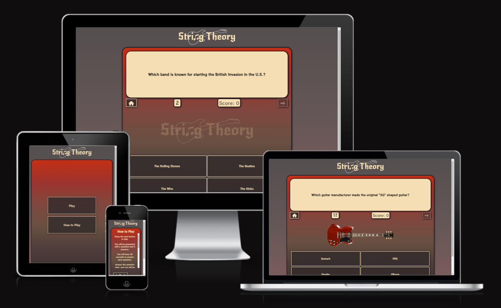
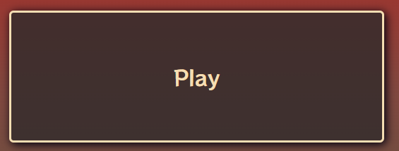

# 

This project is an interactive rock/guitar based quiz called "String Theory". It is intended to provide a fun, replayable experience to the user by offering a random selection of 10 questions from a possible 50+. The quiz uses an unconventional scoring sytem, in which the player gains points equal to the amount of time left on the clock, further encouraging them to play again.

source: [amiresponsive](https://ui.dev/amiresponsive?url=https://ash-5p.github.io/rock-quiz)

## UX

### Colour Scheme

The color scheme is inspired by the appearence of a [vintage 50's Fender Stratocaster](documentation/readme/fender-strat.webp), and wheat coloring aims to emulate the yellowish color of old plastic like that seen on the pickups and tone/volume knobs.

- `#f5deb3` used for primary text.
- `#d8290a` used for primary highlights.
- `#00000f` used for secondary text.
- `#322b2b` used for secondary highlights.
- `#f5deb3` used for text background.
- `#322b2b` used for navigation button background.

I used [coolors.co](https://coolors.co/d8290a-00000f-f5deb3-322b2b) to generate my colour palette.

### Typography

- [RocknRoll One](https://fonts.google.com/specimen/RocknRoll+One) was used for the primary headers and titles.

- [New Rocker](https://fonts.google.com/specimen/New+Rocker) was used for all other secondary text.

- [Font Awesome](https://fontawesome.com) icons were used throughout the site, such as the social media icons in the footer.

## Features

🛑🛑🛑🛑🛑🛑🛑🛑🛑🛑 START OF NOTES (to be deleted)

In this section, you should go over the different parts of your project,
and describe each in a sentence or so.

You will need to explain what value each of the features provides for the user,
focusing on who this website is for, what it is that they want to achieve,
and how your project is the best way to help them achieve these things.

For some/all of your features, you may choose to reference the specific project files that implement them.

IMPORTANT: Remember to always include a screenshot of each individual feature!

🛑🛑🛑🛑🛑🛑🛑🛑🛑🛑-END OF NOTES (to be deleted)

### Existing Features

- **Header Logo**

    - The header logo acts as a link to the main page (index.html).

- **Play Button**

    - The play button starts a new game when clicked.

- **How to Play Button**

    - The "How to Play" button will take the user to the "How to Play" screen which explains the game mechanics.

- **Home Button**

    - The home button allows the player to navigate back to the home screen at any point during the quiz. Effectively acting as a quit game feature.

- **Next Button**

    - The next button is used to navigate to the next question once an answer has been selected, or the timer has reached 0. The button will remain disabled until either of these pre-requisites is achieved.

 

- **Replay Button**

    - The replay button is used to navigate back to the main menu from the final score screen.

- **Answer Buttons**

    - The answer buttons are used by the user as the means to select their answer. Upon selecting an answer, the buttons will change color to indicate a right (green) or wrong (red) answer.

- **How to Play Screen**

    - The "How to Play" screen explained the game mechanics to the user. It also offers a scroll bar for smaller screens which cannot fit all of the text on screen in order to avoid having the text be too small. 

- **Questions**

    - Each question is a multiple choice format, offering 4 choices. A total of 10 random questions out of an array of 50+ will be presented to the player before the game ends. The quiz features a selection of image and non-image questions.

- **Timer**

    - The timer will count down from 20 seconds at the start of each new question. When the timer reaches 0, the correct answer will be revealed and the answer buttons will be disabled.

- **Score**

    - There are 3 actions which affect the game score:
        - A correct answer will increase the player's score by the amount of seconds left on the timer.
        - An incorrect answer will result in a 10 point penalty to the player's score.
        - The timer reaching 0 will result in a 5 point penalty to the player's score.

- **Final Score Screen**

    - The final score screen will appear after question 10, and will display the player's final score. 

- **Social Media Links**

    - The social media links in the footer on all pages will navigate to one of my corrisponding social media accounts. These will open in a new tab due to being external links.

- **Error 404 Page**

    - The 404 page will appear if there is an issue with the page address in the url bar. This will offer instructions/suggestions on how to get back to the main page.

### Future Features

🛑🛑🛑🛑🛑🛑🛑🛑🛑🛑 START OF NOTES (to be deleted)

Do you have additional ideas that you'd like to include on your project in the future?
Fantastic! List them here!
It's always great to have plans for future improvements!
Consider adding any helpful links or notes to help remind you in the future, if you revisit the project in a couple years.

🛑🛑🛑🛑🛑🛑🛑🛑🛑🛑-END OF NOTES (to be deleted)

- Timer Progress Bar
    - I plan to replace the numbered countdown with a depleating timer bar.
- Audio Questions
    - Audio questions will offer a soundbite with a question based of the audio. The user will have to click to play the audio, and the timer will not start until the user has done this.
- Game Modes
    - Audio questions/ Standard Questions/ Image Questions/ Mixed Questions/ Time attack mode

## Tools & Technologies Used

🛑🛑🛑🛑🛑🛑🛑🛑🛑🛑 START OF NOTES (to be deleted)

In this section, you should explain the various tools and technologies used to develop the project.
Make sure to put a link (where applicable) to the source, and explain what each was used for.
Some examples have been provided, but this is just a sample only, your project might've used others.
Feel free to delete any unused items below as necessary.

🛑🛑🛑🛑🛑🛑🛑🛑🛑🛑-END OF NOTES (to be deleted)

-  used to generate README and TESTING templates.
-  used for version control. (`git add`, `git commit`, `git push`)
-  used for secure online code storage.
-  used as a cloud-based IDE for development.
-  used for the main site content.
-  used for the main site design and layout.
-  used for user interaction on the site..
-  used for hosting the deployed front-end site.
-  used as the front-end CSS framework for modern responsiveness and pre-built components.
-  used for creating wireframes.
-  used for the icons.
-  used to help debug, troubleshoot, and explain things. used to generate non-image questions

## Testing

> [!NOTE]  
> For all testing, please refer to the [TESTING.md](TESTING.md) file.

## Deployment

The site was deployed to GitHub Pages. The steps to deploy are as follows:

- In the [GitHub repository](https://github.com/Ash-5p/rock-quiz), navigate to the Settings tab 
- From the source section drop-down menu, select the **Main** Branch, then click "Save".
- The page will be automatically refreshed with a detailed ribbon display to indicate the successful deployment.

The live link can be found [here](https://ash-5p.github.io/rock-quiz)

### Local Deployment

This project can be cloned or forked in order to make a local copy on your own system.

#### Cloning

You can clone the repository by following these steps:

1. Go to the [GitHub repository](https://github.com/Ash-5p/rock-quiz) 
2. Locate the Code button above the list of files and click it 
3. Select if you prefer to clone using HTTPS, SSH, or GitHub CLI and click the copy button to copy the URL to your clipboard
4. Open Git Bash or Terminal
5. Change the current working directory to the one where you want the cloned directory
6. In your IDE Terminal, type the following command to clone my repository:
	- `git clone https://github.com/Ash-5p/rock-quiz.git`
7. Press Enter to create your local clone.

Alternatively, if using Gitpod, you can click below to create your own workspace using this repository.

Please note that in order to directly open the project in Gitpod, you need to have the browser extension installed.
A tutorial on how to do that can be found [here](https://www.gitpod.io/docs/configure/user-settings/browser-extension).

#### Forking

By forking the GitHub Repository, we make a copy of the original repository on our GitHub account to view and/or make changes without affecting the original owner's repository.
You can fork this repository by using the following steps:

1. Log in to GitHub and locate the [GitHub Repository](https://github.com/Ash-5p/rock-quiz)
2. At the top of the Repository (not top of page) just above the "Settings" Button on the menu, locate the "Fork" Button.
3. Once clicked, you should now have a copy of the original repository in your own GitHub account!

### Local VS Deployment

There are no notable differences between the local and deployed site.

## Credits

### Content

| Source | Location | Notes |
| --- | --- | --- |
| [Markdown Builder](https://tim.2bn.dev/markdown-builder) | README and TESTING | tool to help generate the Markdown files |
| [Chris Beams](https://chris.beams.io/posts/git-commit) | version control | "How to Write a Git Commit Message" |
| [Web Dev Simplified](https://github.com/WebDevSimplified/JavaScript-Quiz-App/blob/master/script.js#L17C2-L18C27) | scripts.js | shuffle questions |
| [Web Dev Simplified](https://github.com/WebDevSimplified/JavaScript-Quiz-App/blob/master/script.js#L24C1-L25C56) | scripts.js | nextQuestion function |
| [Web Dev Simplified](https://github.com/WebDevSimplified/JavaScript-Quiz-App/blob/master/script.js#L45C1-L46C70) | scripts.js | resetState function |
| [Web Dev Simplified](https://github.com/WebDevSimplified/JavaScript-Quiz-App/blob/master/script.js#L54C1-L55C51) | scripts.js | selectAnswer function |
| [Web Dev Simplified](https://github.com/WebDevSimplified/JavaScript-Quiz-App/blob/master/script.js#L65C1-L77C2) | scripts.js | clearStatusClass & setStatusClass functions |

### Media

| Source | Location | Type | Notes |
| --- | --- | --- | --- |
| [Music Radar](https://cdn.mos.cms.futurecdn.net/XXRptkBUCmWqW6Wysqfm5P-1200-80.jpg.webp) | question | image | cloud guitar question | 
| [Heritage Auctions](https://dyn1.heritagestatic.com/lf?set=path%5B4%2F7%2F5%2F9%2F4759129%5D%2Csizedata%5B850x600%5D&call=url%5Bfile%3Aproduct.chain%5D) | question | image | axe guitar question |
| [Brian May Guitars](https://shop.brianmayguitars.co.uk/user/special/content/Antique%20Cherry%20b.jpg) | question | image | BM guitar question | 
| [Ground Guitars](https://www.groundguitar.com/wp-content/uploads/2022/05/Kramer-5150-Eddie-Van-Halen.jpg) | question | image | 5150 guitar question | 
| [Guitar](https://www.guitar.co.uk/media/catalog/product/cache/1/image/800x400/9df78eab33525d08d6e5fb8d27136e95/f/e/fender_kurt_cobain_jag-stang_sonic_blue_front.jpeg) | question | image | Kurt Cobain guitar question |
| [ESP Guitars](https://cdn.connectsites.net/user_files/esp/product_images/000/009/980/original.png?1389980044) | question | image |  snakebyte guitar question |
| [Reverb](https://rvb-img.reverb.com/image/upload/s--UnfJb080--/a_exif,c_limit,e_unsharp_mask:80,f_auto,fl_progressive,g_south,h_1600,q_80,w_1600/v1459200223/df61mcxwwunthem8u8mc.jpg) | question | image | Dave Mustaine guitar question |
| [Guitar Village](https://guitarvillage.co.uk/wp-content/uploads/2022/10/Gibson-SG-Standard-61-Vintage-Cherry-030_01-compress.jpg) | question | image |  SG guitar question |
| [Music Man](https://s3-us-west-2.amazonaws.com/static.music-man.com/website/images/instruments/instrument-1.png?1695268095) | question | image |  Music Man guitar question |
| [The Music Emporium](https://themusicemporium.com/cdn/shop/files/FEN-CS58SCAR-1.jpg?v=1700854507) | README | image | 50's Stratocaster |
| [Pintrest](https://i.pinimg.com/originals/7d/eb/dc/7debdcad8fea68ba6c57eb1e347d737d.png) | favicon | image | favicon |
| [PNG Wing](https://w7.pngwing.com/pngs/369/305/png-transparent-musical-note-musical-theatre-double-whole-note-musical-note-photography-rectangle-monochrome-thumbnail.png) | all pages | image |  header logo |
| [Super Coloring](https://www.supercoloring.com/sites/default/files/fif/2024/02/shape-of-electric-guitar-electric-guitar-1-paper-crafts.png) | all pages | image | header logo |
| [removebg](https://www.remove.bg/) | entire site | image | tool for making image backgrounds transparent |
| [GIMP](https://www.gimp.org/) | entire site | image | tool for editing images |

### Acknowledgements

- I would like to thank my Code Institute mentor, [Tim Nelson](https://github.com/TravelTimN) for his support throughout the development of this project.
- I would like to thank the [Code Institute](https://codeinstitute.net) tutor team for their assistance with troubleshooting and debugging some project issues.
- I would like to thank the [Code Institute Slack community](https://code-institute-room.slack.com) for the moral support; it kept me going during periods of self doubt and imposter syndrome.
- I would like to thank my partner (Lorna), for believing in me, and allowing me to make this transition into software development.
