# Testing

> [!NOTE]  
> Return back to the [README.md](README.md) file.

## Code Validation

### HTML

I have used the recommended [HTML W3C Validator](https://validator.w3.org) to validate all of my HTML files.

| Directory | File | Screenshot | Notes |
| --- | --- | --- | --- |
|  | index.html |  | No errors or warnings |
|  | 404.html |  | No errors or warnings |

### CSS

I have used the recommended [CSS Jigsaw Validator](https://jigsaw.w3.org/css-validator) to validate all of my CSS files.

| Directory | File | Screenshot | Notes |
| --- | --- | --- | --- |
| assets | style.css |  | |

### JavaScript

I have used the recommended [JShint Validator](https://jshint.com) to validate all of my JS files.

| Directory | File | Screenshot | Notes |
| --- | --- | --- | --- |
| assets | script.js |  | |
| assets | questions.js |  | |

## Browser Compatibility

I've tested my deployed project on multiple browsers to check for compatibility issues.

| Browser | Home | Question | Image Question | How-to | Score | 404 | Notes |
| --- | --- | --- | --- | --- | --- | --- | --- |
| Chrome |  |  |  |  |  |  | Works as expected |
| Edge | 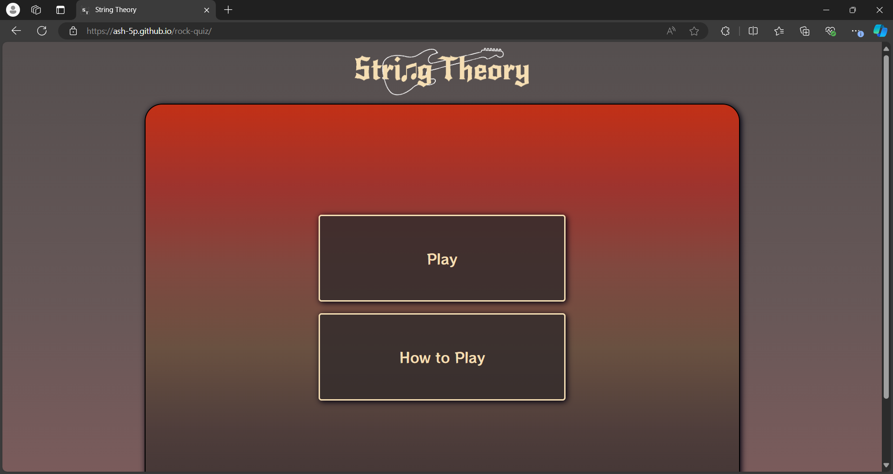 |  |  | 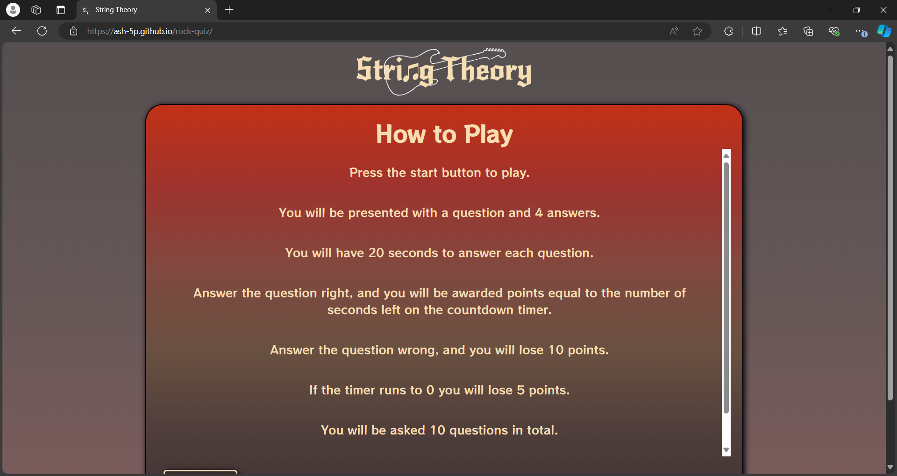 | 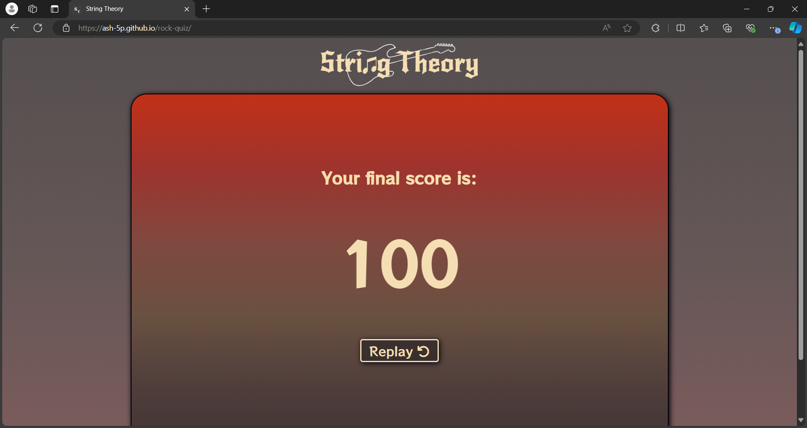 |  | Works as expected |
| Opera | 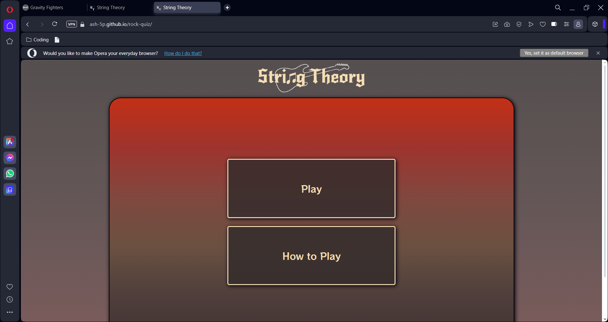 |  |  |  |  |  | Works as expected |

## Responsiveness

I've tested my deployed project on multiple devices to check for responsiveness issues.

| Device | Home | Question | Image Question | How-to | Score | 404 | Notes |
| --- | --- | --- | --- | --- | --- | --- | --- |
| 4K Monitor |  | 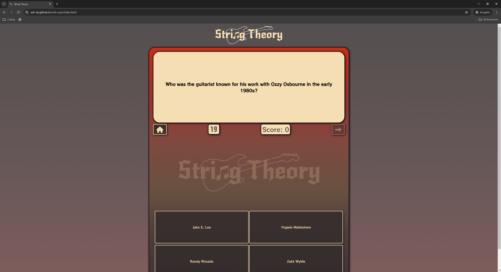 |  |  |  |  | Works as expected |
| Laptop |  |  |  |  | 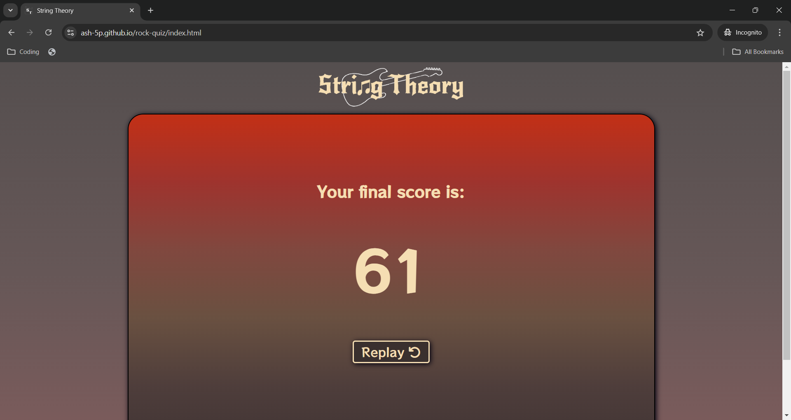 |  | Works as expected |
| Tablet (Dev Tools) | 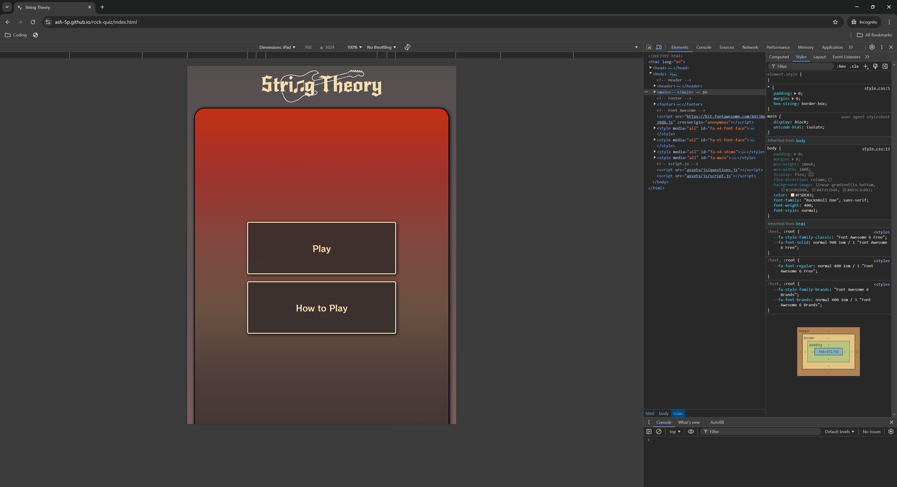 |  | 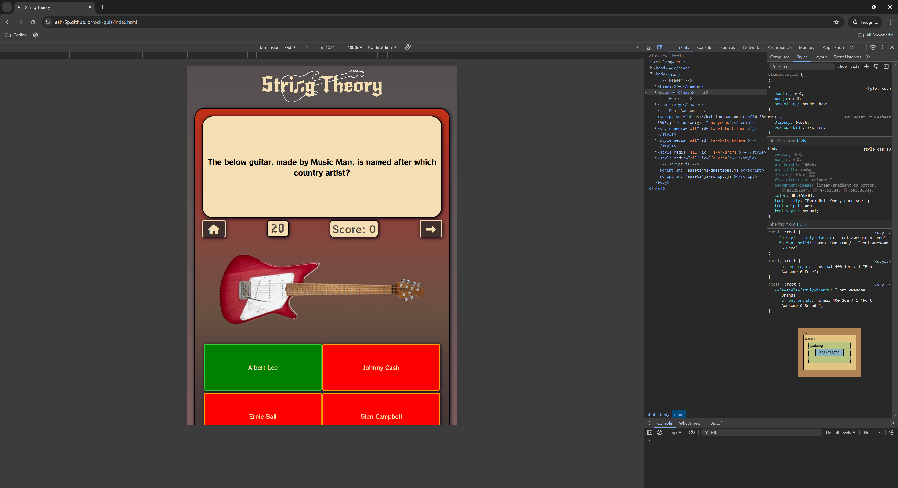 |  |  |  | Works as expected |
| Mobile (Dev Tools) |  |  |  |  |  |  | Works as expected |
| Google Pixel 7 Pro |  | 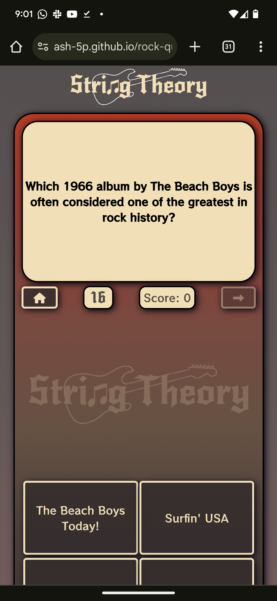 |  |  | 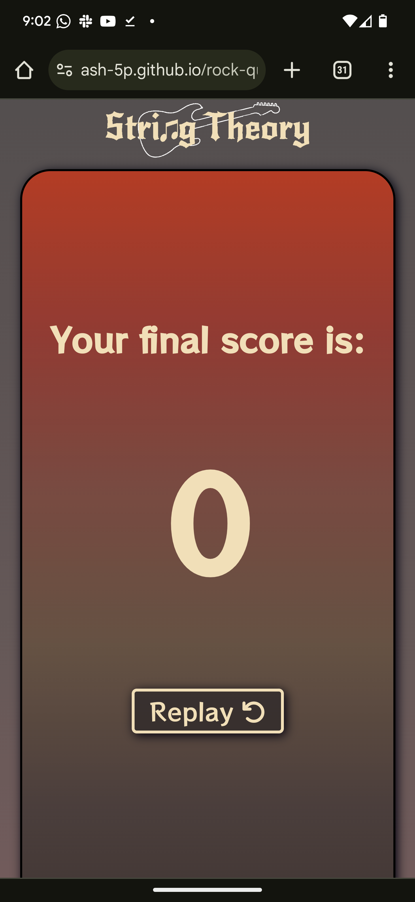 |  | Works as expected |

## Lighthouse Audit

I've tested my deployed project using the Lighthouse Audit tool to check for any major issues.

| Page | Mobile | Desktop | Notes |
| --- | --- | --- | --- |
| Index |  |  | Some minor warnings |
| 404 |  |  | Performance warning for mobile |

## Defensive Programming

Defensive programming was manually tested with the below user acceptance testing:

| Page | Expectation | Test | Result | Fix | Screenshot (Before) | Screenshot (After)
| --- | --- | --- | --- | --- | --- | --- |
| Index | | | | | | |
| | The "Play" button is expected to start a new game when the user clicks it. | Tested the feature by clicking "Play" button | The feature behaved as expected, and it started a new game. This includes shuffling questions, reseting question index number, and resetting score & timer | Test concluded and passed |  |  |
| | The "How to Play" button is expected to take the user to the "How to Play" screen when the user clicks it. | Tested the feature by clicking the "How to Play" button | The feature behaved as expected and took the user to the "How to Play" screen. | Test concluded and passed |  |  |
| | The "How to Play" Screen is expected to add a vertical scroll feature within the game area for screens which are too small to fit the whole block of text. | Tested the feature by observing the  | The feature behaved as expected and the final score screen was shown after the 10th question each time, displaying the correct player score. | Test concluded and passed |  |  |
| | The "Back" button is expected to take the user to the back to the homescreen when the user clicks it. | Tested the feature by clicking the "Back" button | The feature behaved as expected and took the user back to the homescreen. | Test concluded and passed |  |  |
| | The "Home" button is expected to take the user back to the homescreen when the user clicks it. | Tested the feature by clicking the "Home"" button | The feature behaved as expected and took the user to the homescreen. | Test concluded and passed |  |  |
| | The "Replay" button is expected to take the user back to the homescreen when the user clicks it. | Tested the feature by clicking the "Replay"" button | The feature behaved as expected and took the user to the homescreen. | Test concluded and passed |  |  |
| | The question shuffle feature is expected to randomly pull 10 questions from an array of 50+ possible questions each time a new game is started. | Tested the feature by playing through the quiz multiple multiple times to ensure questions were totally random. | The feature behaved as expected and 10/50+ questions appear in a random order each time the game is played. | Test concluded and passed |  | 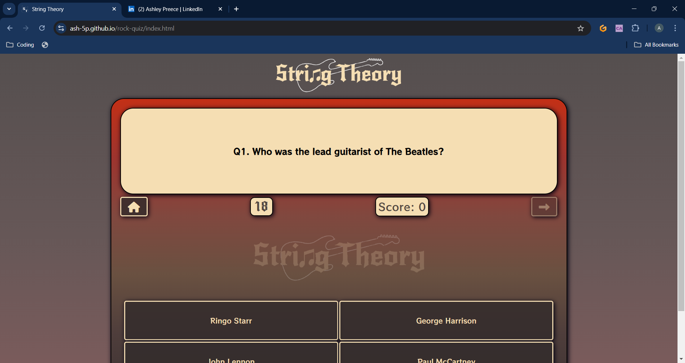 |
| | The "Next" button is expected to take the user to the next question when the user clicks it. | Tested the feature by clicking the "Home"" button | The feature behaved as expected and took the user to the next question. | Test concluded and passed |  |  |
| | The "Next" button is expected to be disabled (and faded out) at the start of a new question, until the timer runs out or the user selects an answer. | Tested the feature by clicking the "Next" button before selecting an answer or allowing the timer to run out. Then reapeated the test once the timer had run out and repeated test by selecting an answer. | The feature behaved as expected and did not allow the user to interact with it until either pre-requesit had been achieved. | Test concluded and passed |  |  |
| | The answer buttons are expected to change red/green when an answer is selected in order to indicate a right (green) or wrong (red) answer. Upon selecting an answer, all of the answer buttons will be disabled in order to prevent further input | Tested the feature by clicking one of the answer buttons to see if they change to the correct color, then tried to click each answer again to check that the buttons were disabled | The feature behaved as expected and the correct answer turned green, while the incorrect answers turned red. All buttons were disabled | Test concluded and passed |  |  |
| | The player score is expected to increase by the number of seconds remaining on the clock when the timer when the player selects the correct answer. | Tested the feature by selecting the correct answer while the timer was at a few different values. | The feature behaved as expected and added points to the player score equivelant to the remaing time. | Test concluded and passed |  |  |
| | The player score is expected to decrease by the 10 points when the user selects an incorrect answer. | Tested the feature by selecting an incorrect answer (while having 10 or more points already). | The feature behaved as expected and reduced the player score by 10. | Test concluded and passed |  |  |
| | The player score is expected to never become a negative value. Therefore when incurring a point penalty (timeout or incorrect answer) when the player score is less than the penalty value, the player score will reduce to 0. | Tested the feature by allowing the timer to run out while the player score was 0. | The feature behaved as expected did not reduce the score to a negative value. | Test concluded and passed | 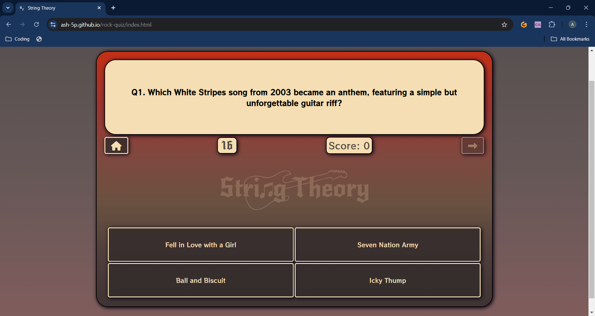 | 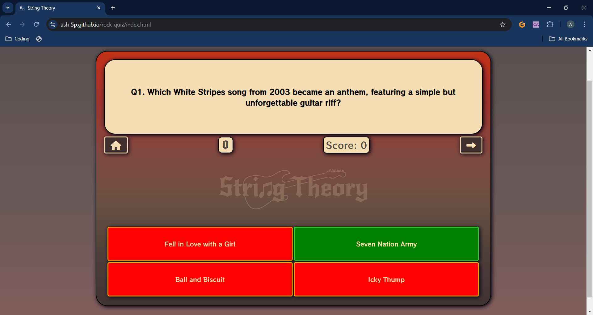 |
| | The timer is expected to start a 20 second countdown at the start of each question. | Tested the feature by starting a new game to see if the timer started at 20 seconds, then moved to next question to check that the timer had reset. | The feature behaved as expected and started at 20 seconds for each new question. | Test concluded and passed |  |  |
| | The timer is expected to stop when an answer is selected. | Tested the feature by selecting an answer. | The feature behaved as expected and the timer stopped when an answer was clicked. | Test concluded and passed |  |  |
| | The timer is expected to stop when it reaches 0. | Tested the feature by letting the timer run out. | The feature did not behave as expected, and proceeded to count negative numbers. | I had to add the following line of code to script.js: `clearInterval(timerInterval);` Timer now works as expected. Test concluded and passed |  | |
| | The final score screen is expected to appear when the user clicks the "Next" button after 10 questions. It will display the players final score. | Tested the feature by answering 10 questions. Repeated x3 | The feature behaved as expected and the final score screen was shown after the 10th question each time, displaying the correct player score. | Test concluded and passed |  |  |
| 404 | | | | | | |
| | The homepage link is take the user back to the home screen on index.html when clicked | Tested the feature by clicking the link | The feature behaved as expected, navigated to the home screen | Test concluded and passed |  ||
| All Pages | | | | | | |
| | The header logo is expected to navigate to the home screen when clicked | Tested the feature by clicking the header logo | The feature behaved as expected, and navigated to home screen | Test concluded and passed |  | |
| | The social media links are expected to navigate to my corresponding social media profile in a new tab| Tested the feature by clicking both links to make sure each opened in a new tab, and navigated to the correct url | The feature behaved as expected, and opened each corresponding link in a new tab. | Test concluded and passed |  |  |

## Bugs

- JS Negative timer: Timer carried on past 0, and would increase in speed every time the game state was reset.

    

    - To fix this, I added `clearInterval(timerInterval);` to lines 145, 218 & 228.

- JS Negative score: Score would drop to a negative number if the player score was less than the penalty incurred

    

    - To fix this, I added `if` statements to `checkAnswers()` & `timeout()` functions which would call the `resetState()` function if the player score was less than respective point penalty, returning the score to 0.

## Unfixed Bugs

- On devices smaller than 369px, there is text overflow on some of the answer buttons 

    

    - Attempted fix: I tried to add additional media queries to handle this, but things started becoming too small to read.

> [!NOTE]  
> There are no remaining bugs that I am aware of.
